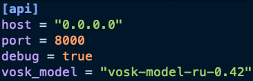

# Automatic Speech Recognition

API по преобразованию аудио в текст, на вход которого мы подаем аудиофайл в формате mp3 или url, например такой
https://www.russianforfree.com/resources/audio_dialogues/01-01-lutshiy-drug.mp3
а на выходе получаем json.

## Установка и запуск

Перед запуском и установкой, скачать модель из https://alphacephei.com/vosk/models/vosk-model-ru-0.42.zip и поместить её по пути src/application/asr/models. Этa модель - "vosk-model-ru-0.42" - указана в config/config.template.toml<br /> 

Можете любую версию установить, кроме small, только поменяйте vosk_model в config/config.template.toml

```bash
git clone https://github.com/daron035/asr.git
cd asr

# запуск локально - точно работает
make install
source .venv/bin/activate
make run

# запуск через докер - вроде работает
make up
```
